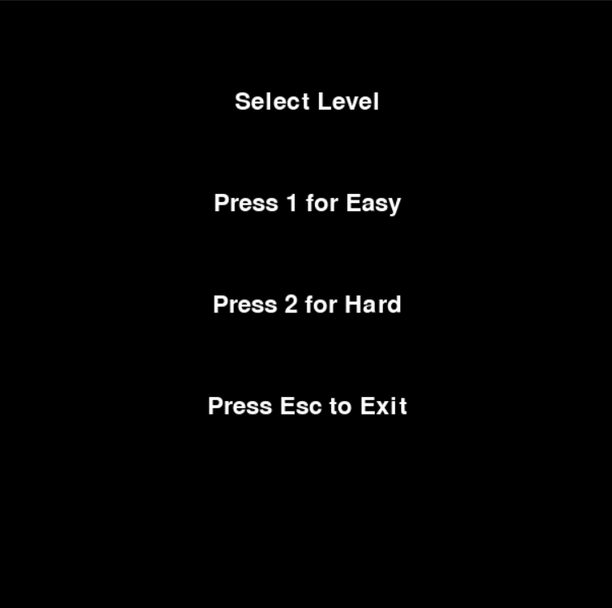

# Pacman Game with PyGame

This is a Python implementation of the classic **Pacman** game using the **PyGame** library. The game includes two levels of difficulty: **Easy** and **Hard**. In the **Easy** mode, ghosts follow predefined paths, while in the **Hard** mode, they dynamically chase Pacman using a **pathfinding algorithm**.

## Features
- **Classic Gameplay**: Navigate Pacman through a maze, eat pellets, and avoid ghosts.
- **Levels**:
  - **Easy**: Ghosts move on predefined paths.
  - **Hard**: Ghosts dynamically chase Pacman using a pathfinding algorithm.
- **Dynamic Ghost Behavior**: In Hard mode, ghosts use **Breadth-First Search (BFS)** to locate Pacman and navigate the maze intelligently.
- **Winning and Losing States**: Win by eating all pellets, or lose if caught by a ghost.
- **Level Selection Screen**: Choose between Easy and Hard modes at the start.

---
## Installation and Setup
1. Clone the repository:
   ```bash
   git clone https://github.com/username/Pacman
2. Navigate to the project directory:
    ```bash
    cd Pacman
3. Install required dependencies
    ```bash
    pip install pygame
# How to Play
1. Run the game:
    ```bash
    python pacman.py

## Level Selection
- **Press 1**: Start Easy Mode.
- **Press 2**: Start Hard Mode.
---

## Gameplay Instructions
- Use the **arrow keys** to move Pacman:
  - **↑**: Move up.
  - **↓**: Move down.
  - **←**: Move left.
  - **→**: Move right.
- **Your objective is to:**
  - Eat all the pellets to win.
  - Avoid the ghosts. If they catch you, the game is over.

---

## Easy Level: Predefined Paths
In Easy mode:
- Ghosts move along **predefined paths** in the maze.
- Their movements are not influenced by Pacman's position.
- This mode is great for beginners who want to learn the mechanics of the game.

---

## Hard Level: Pathfinding Algorithm
In Hard mode:
- Ghosts dynamically chase Pacman using a **Breadth-First Search (BFS)** pathfinding algorithm.
- Ghosts calculate the shortest path to Pacman's current position.
- Walls and obstacles are respected during pathfinding.
- This mode provides a more challenging and engaging experience.

---

## Controls
- **Arrow Keys**: Move Pacman.
- **Esc**: Quit the game.
- **Enter**: Restart the game after winning or losing.

---

## Screenshots
### Level Selection Screen


### Easy Mode Gameplay


### Hard Mode Gameplay


---

## Future Improvements
- Add power-ups for Pacman (e.g., temporarily eat ghosts).
- Introduce more levels with varying maze designs.
- Enhance ghost AI with additional algorithms for unpredictability.

---

---

## Contributing
Contributions are welcome! Feel free to fork this repository, make changes, and submit a pull request.
